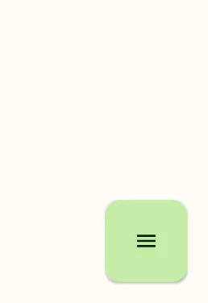

# AnimatedFABMenu

  

A Custom Android UI component, Build with Jetpack Compose, allows you to add a beautiful material 3 designed floating menu,
which can be shown or hidden with beautiful animations by pressing the attached FAB.. 
